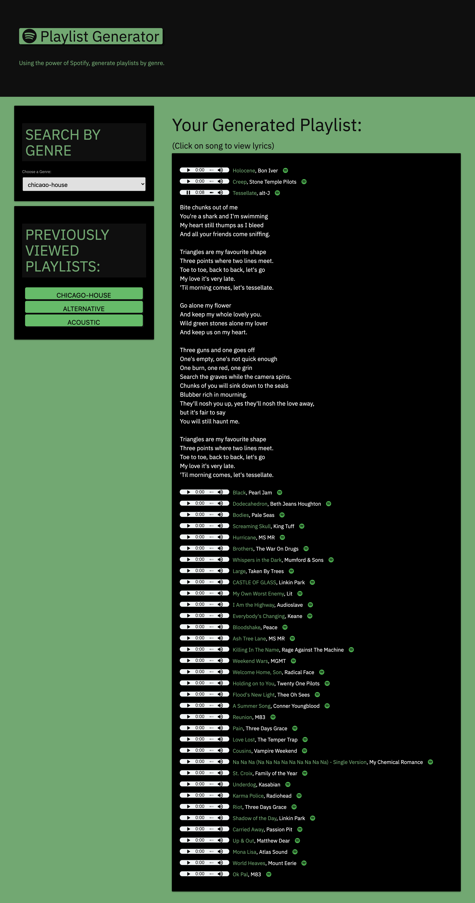

# Playlist Generator
Coding BootCamp Group Project
## Description
An application that gives the user the option to create playlists based on a genre. A playlist is displayed with a preview as well as lyrics and a link to the spotify page for the song.
## Usage
Select genre from the dropdown menu and the playlist will be instantly displayed. Each song is displayed with a media player that gives a 30 second preview. When a song is clicked the lyrics will be displayed directly below the song. The spotify logo after each song will open a new tab to the song's spotify page giving the user the option to save it to their spotify profile. After each playlist is generated, a button below the dropdown menu will save the three most recent playlists so the user can load a recent playlist.
## Contributors
* [Jose Pina](https://github.com/JoseEPina)
* [Colton Bloomquist](https://github.com/ColtonBloomquist)
* [Mitchell Lyon](https://github.com/mitchlyon)
* [Andrew Durham](https://github.com/andydhpkp)
## Acknowledgements
* [Spotify API](https://developer.spotify.com/documentation/web-api/)
* [Vagalume API](https://api.vagalume.com.br/)
## Deployment Link
* https://joseepina.github.io/bc-project-01/
## Screenshot

